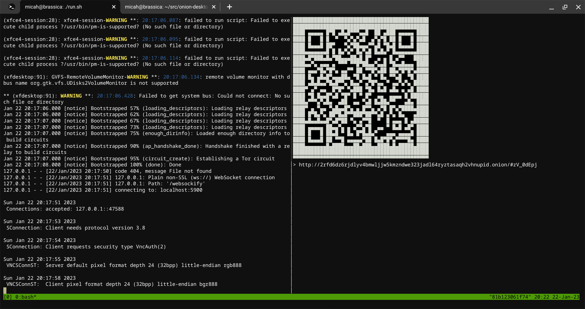
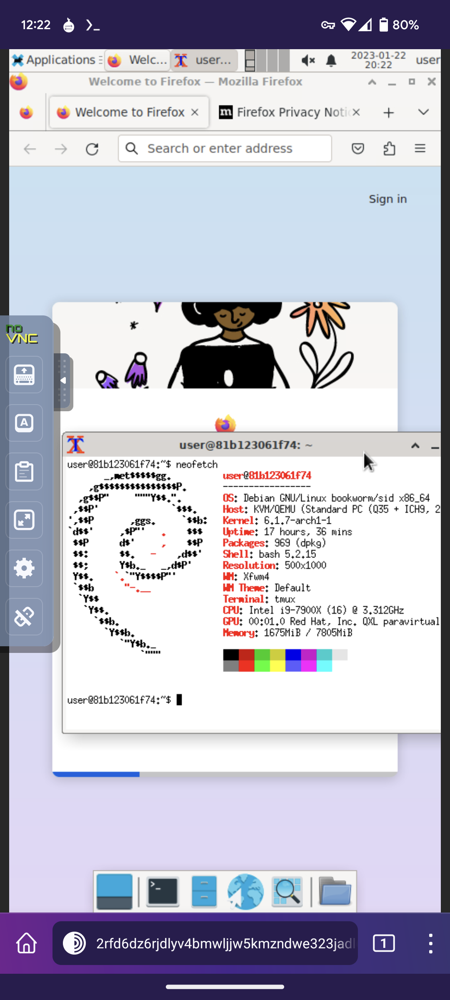

Onion Desktop
=============

This is just a toy for now. I wanted to get a feel for the interactive
performance of onion services, and it's perhaps sometimes useful if
you'd like to share a disposable slice of your computer with a phone
when they're both behind NAT.

This is a very simple Docker container that runs an xfce4 desktop,
novnc, and tor. It will randomly generate a new onion service URL and
a VNC password, and show you a tmux with session logs on the left and
a big QR code you can scan on the right.

In this configuration, the container's root user is only intended to
be used during setup. There is no login password or sudo access set up.
You can add more packages to the Dockerfile easily enough.

Anyone who has the onion URL and VNC password (or cares to try brute
forcing the password) can use or try to escape your container, but the
connection is encrypted end-to-end by Tor.

Example
=======

Terminal output from `run.sh`, with session logs on the left and the QR code on the right:

Example session. The xfce4 desktop loads right after scanning the QR code in Tor Browser:

